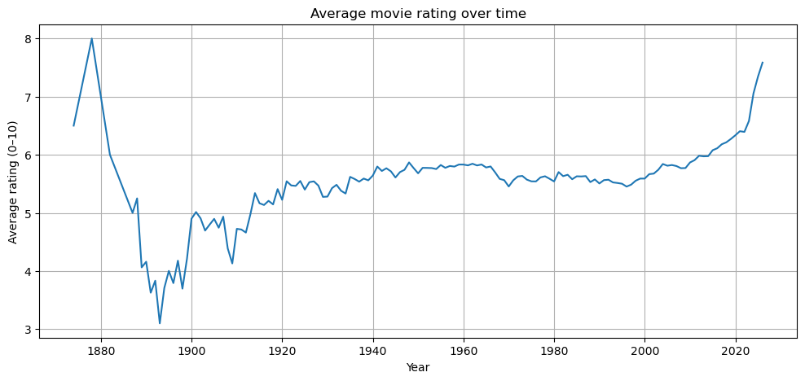
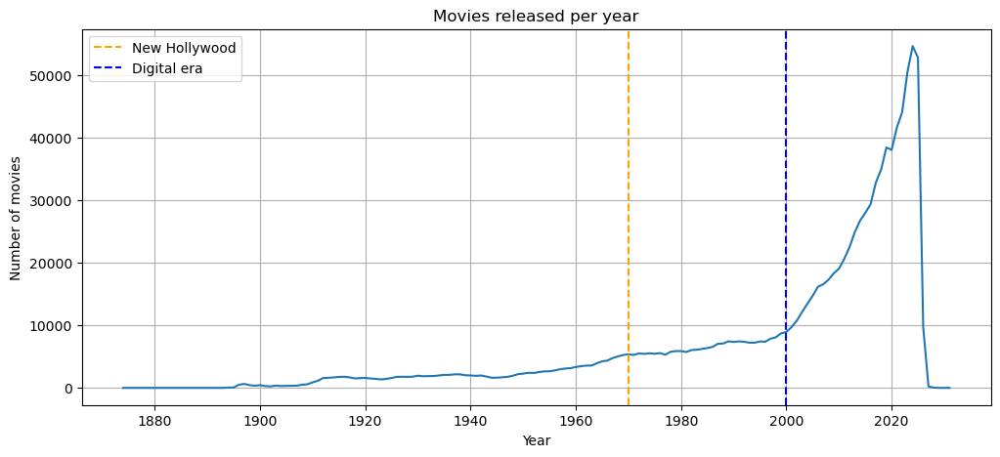

# Project of Data Visualization (COM-480)

| Student's name | SCIPER |
| -------------- | ------ |
| Belmekki Rihab | |
| Mellouk Adam | 324233 |
| Kenza Oudrhiri Benaddach | |

[Milestone 1](#milestone-1) • [Milestone 2](#milestone-2) • [Milestone 3](#milestone-3)

## Milestone 1 (20th March, 5pm)

**10% of the final grade**

This is a preliminary milestone to let you set up goals for your final project and assess the feasibility of your ideas.
Please, fill the following sections about your project.

*(max. 2000 characters per section)*

### Dataset

We use the **TMDB Movies Daily Updates dataset**, which provides a comprehensive and up-to-date collection of metadata for over one million movies.  

The dataset is sourced from **The Movie Database (TMDB)**, a platform used for film-related information, and is regularly updated to reflect new releases and evolving metrics.  

- 1,169,605 movies, from 1988 to 2031  
- 28 variables that describe each movie, including identification details, popularity and ratings, financial performance, content, and cast and crew information  

Note: The dataset required preprocessing due to the presence of missing values and outliers, which are addressed in detail in the notebook.  

**Source:** The Ultimate 1Million Movies Dataset (TMDB + IMDb)

### Problematic

Cinema has constantly evolved over time, reflecting changes in technology, culture, and audience preferences. However, these transformations are often difficult to grasp without an interactive way to explore the data.  

In this project, we aim to understand how the movie industry has changed over the years by analyzing trends in genres, budgets, revenues and audience ratings. Our goal is to provide an interactive visualization that allows users to explore the evolution of cinema across decades, identify major shifts in production and popularity, and understand how different types of movies have emerged or declined over time.  

By combining multiple visual perspectives, we want to highlight both long-term trends and more subtle patterns that are not immediately visible in raw data.  

This project is designed for a general audience, including movie enthusiasts and students, who are interested in discovering how the film industry has developed and what factors have shaped its evolution.  

Our main problematics are:

- How has movie production evolved over time?  
- How have average ratings and popularity changed across decades?  
- How have financial aspects, such as budgets and revenues, evolved over time?  
- How has the distribution and success of different genres changed?  
- What relationships exist between key variables such as budget, revenue, popularity, and ratings? 

### Exploratory Data Analysis

The exploratory data analysis (EDA) is detailed in the accompanying notebook.  

During this step, we performed several preprocessing operations to make the data usable, including handling missing values and converting date and text fields into exploitable formats.  

We got our initial insights into the dataset, focusing on the following aspects (they are explained in the notebook):  

Average Rating

Average Runtime

Movies released

### Related work

Looking at existing projects built on the TMDB dataset, a clear pattern emerges in how the data is typically used. A large number of notebooks focus on recommendation systems. For example, the *Hybrid Movie Recommendation System | Kaggle* builds a model that suggests movies based on similarity between genres and metadata, while other projects take a more predictive approach, using models such as LightGBM or CatBoost to estimate ratings or identify which features contribute most to a movie’s success.  

Another common direction is exploratory data analysis. Notebooks like *TMDB Movies Analysis* or *TMDB Complete EDA* look at distributions of ratings, revenues, or genres, usually through standard plots such as histograms or bar charts. These analyses are useful to get a general understanding of the dataset, but they are often static and focus on isolated aspects of the data rather than providing a broader narrative.  

Some projects also explore ways to enrich or present the data differently. For instance, *TMDB Movies - Extract & Show Posters* focuses on retrieving movie posters and combining them with metadata, which improves the visual aspect but does not necessarily explore deeper trends.  

Overall, most existing work either aims at prediction or provides static summaries of the data. But this is the direction we want to take: instead of predicting or summarizing, we aim to let users explore how cinema has changed across decades, and how trends in genres, popularity, and financial performance have emerged and shifted over time.  

For the design of our visualization, we were inspired by several interactive websites and editorial-style layouts that emphasize storytelling through scrolling (see *inspos.pdf*).  

We chose to use a **continuous vertical flow** rather than separating content into distinct pages or frames, creating a sense of progression where the user is guided through a narrative.  

We also aim to structure the visualization with a **timeline**, which will act as a *fil directeur* connecting all sections.  

At the beginning, the interface will evoke early cinema through black-and-white visuals (see inspirations in the PDF, or this [link](https://drive.google.com/file/d/1roxPEVKd9VHDbTiUr3gVyJIvhJNkZZ3m/view?usp=sharing)), and will gradually transition into more colorful and dynamic representations as we move toward modern movies.  

This progression is intended to make the evolution of the film industry not only visible in the data, but also perceptible through the visual experience itself.  

## Milestone 2 (17th April, 5pm)

**10% of the final grade**

## Milestone 3 (29th May, 5pm)

**80% of the final grade**

## Late policy

- < 24h: 80% of the grade for the milestone
- < 48h: 70% of the grade for the milestone

